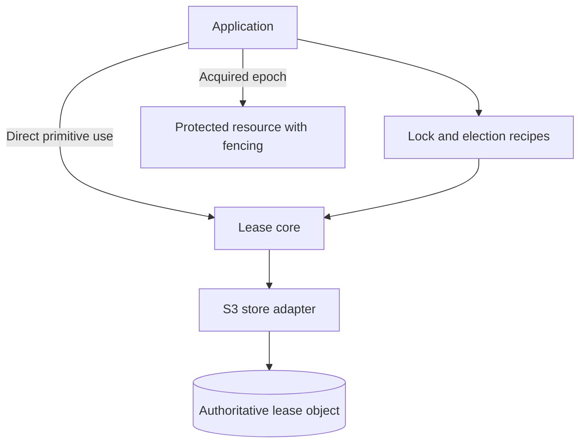
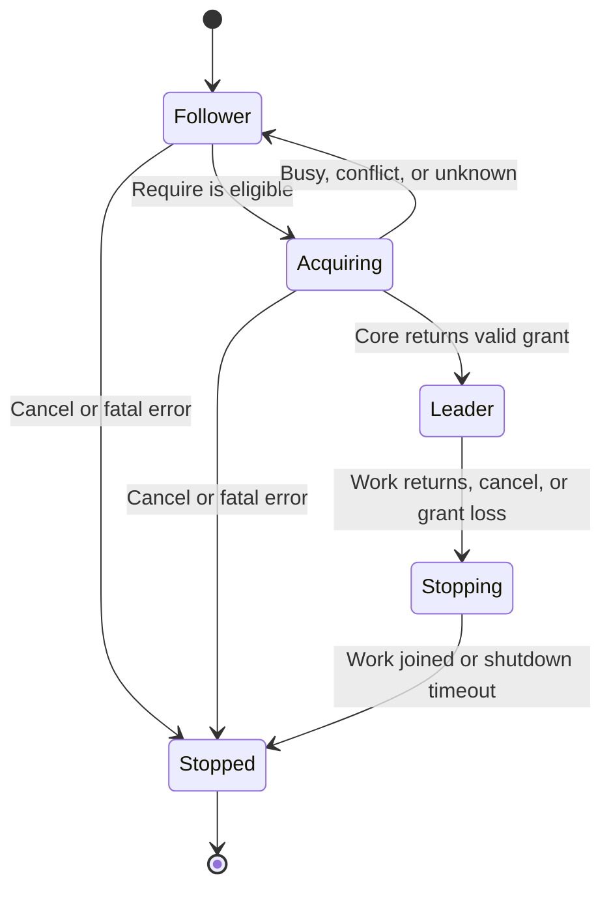

# S3 Lease Core and Coordination Recipes

> High-Level Design · Go Implementation · Lease Core, Distributed Lock, and Leader Election

| Document property | Value |
| --- | --- |
| Status | Draft / High-Level Design |
| Version | v0.8-en, explicit client/acquired-lease naming and responsibilities |
| Date | 2026-08-28 |
| Audience | Distributed systems, storage platform, and Go engineering teams |
| Scope | Lease coordination and leader election within one Region, using one authoritative S3 bucket |

**Summary:** S3 conditional writes and strongly consistent reads can support a Kubernetes Lease-style election protocol. A lease alone does not prevent a former leader from continuing to execute. Work that changes protected resources therefore requires fencing enforced by those resources.

This English revision consolidates the design decisions. The protocol and interfaces are a specification to implement, not a tested implementation or a formal correctness proof. The SeaweedFS and AWS suites are planned validation, not reported test results. Earlier terminology and migration notes are isolated in Appendix A.

## 0. Design Summary

Each lease is represented by one stable S3 object key. Its body contains the stable client ID, lease parameters, diagnostic timestamps, leadership epoch, and mutation sequence. The epoch serves as the fencing token. The object's ETag is used as an opaque conditional-write validator, serving a role similar to Kubernetes `resourceVersion`.

Creation uses `If-None-Match: *`. Renewal, takeover, and release use `If-Match` with the previously observed ETag. These operations rely on S3's documented [conditional write semantics](https://docs.aws.amazon.com/AmazonS3/latest/userguide/conditional-writes.html) and [consistency model](https://docs.aws.amazon.com/AmazonS3/latest/userguide/Welcome.html#ConsistencyModel).

A candidate does not compare its wall clock with the stored `renewTime`. Instead, it measures how long the observed record has remained unchanged using its own monotonic clock. This follows the local-observation approach used by [client-go leader election](https://github.com/kubernetes/client-go/blob/master/tools/leaderelection/leaderelection.go).

The main design decisions are:

- Keep the lease object for its entire coordination lifetime. Release clears ownership through CAS rather than deleting the object.
- Require all participants to use the same authoritative Region, bucket, and key.
- Identify a lease by `(bucket, full object key)` within that backend; do not require Kubernetes-style namespace/name addressing.
- Put `Require` and `Renew` in the Lease core, with `Release` and `Observe` as supporting primitives. The core performs no automatic acquisition loop, renewal loop, business callback, or background S3 polling.
- Put distributed locking, leader election, retry scheduling, automatic renewal, and observation callbacks in `recipes`. Recipe-managed polling may use conditional GET; it is not a complete change stream or Kubernetes Watch equivalent.
- Expose a locally confirmed epoch and a leadership context. Applications enforce fencing at protected resources; no configuration switch makes unguarded writes safe.
- Treat unconfirmed acquisition as a normal availability failure: do not start leader work; recover through ordinary observation and acquisition.
- Keep each mutation's first-send time fixed across retries and reconciliation. Reading a committed renewal does not renew it again.
- Make each election run single-use. Recipes cancel and join their tracked work before any optional release; direct core users are responsible for the same quiescence precondition.
- Preserve fencing tokens across release, process restarts, and operational recovery.
- Exercise the production Go S3 adapter against a pinned single-node SeaweedFS instance in local and CI E2E tests; retain a separate real-AWS compatibility gate.

S3 is the coordination authority. The design removes the need to deploy another coordination service; it does not eliminate coordination itself.

| Decision | First-release contract |
| --- | --- |
| Lease identity | Configured authoritative backend, bucket, and full object key |
| Client and mutation identity | Stable `clientID`, per-grant `epochID`, per-epoch `sequenceID`; no session or oracle service |
| Core acquisition | `Require` performs one logical acquisition attempt; conditional PUT grants ownership, and GET acquires no separate lock |
| Composition | Locking and election are recipes over the same core; they use the same record format and never bypass the core with direct store writes |
| Local work authorization | Timely explicit acquisition success, an active local grant, and its unexpired deadline |
| Observation | Current snapshots that can lag or skip intermediate transitions; never work authorization |
| Resource safety | Application-supplied atomic fencing using the acquired epoch |
| Recovery after response loss | Conservative retry/reconciliation rules; a temporarily idle occupied lease is acceptable |

## 1. Goals and Non-Goals

### 1.1 Goals

- Provide a small Lease core centered on `Require` and `Renew`, with explicit `Release` and `Observe`.
- Build distributed-lock and leader-election recipes on that core; the election recipe provides lifecycle behavior similar to client-go LeaderElector.
- Depend only on S3 for authoritative coordination state, without requiring Kubernetes API access, etcd, ZooKeeper, or a separate database.
- Define behavior during process crashes, network timeouts, long pauses, and concurrent takeover attempts.
- Provide a Go library with testable timing, replaceable storage adapters, metrics, and explicit error categories.

### 1.2 Non-Goals

- Fair locks or strict FIFO acquisition.
- Linearizable coordination across independently writable regional replicas.
- Automatic multi-object transactions. Applications still need their own commit or resource-fencing protocol.
- Submillisecond renewal latency or high-throughput, highly contended locking.
- Protection against malicious participants that can write arbitrary lease contents. Participants are trusted to follow the protocol; IAM limits their access scope.
- Lossless or replayable leadership events, cross-client notification barriers, and a native S3 Watch API.
- Leader endpoint discovery, application readiness publication, or automatic redirection of business requests.
- Session management, an epoch oracle, automatic lease-state-loss recovery, or a general-purpose resource-fencing framework.

## 2. Mapping Kubernetes Lease Semantics to S3

Kubernetes uses Lease objects for coordination, including component leader election. See [Kubernetes Leases](https://kubernetes.io/docs/concepts/architecture/leases/).

| Kubernetes / client-go concept | S3 lease equivalent | Notes |
| --- | --- | --- |
| Lease object | Stable S3 bucket and full object key | One lease per coordinated resource; no separate namespace field |
| `metadata.resourceVersion` | ETag | Opaque CAS validator, not a numeric revision |
| Create if absent | `PUT` with `If-None-Match: *` | Creates only when no current object exists |
| Update | `PUT` with `If-Match: <etag>` | Used for renewal, takeover, and release |
| Get | GET | Returns the record and ETag; HEAD alone does not return the record body |
| Kubernetes Watch | No equivalent in the core library | Polling exposes current observations and may skip transitions; notifications are hints only |
| `holderIdentity` | `clientID` | Stable logical client name; a new local run must obtain a new epoch rather than adopt a matching name |
| `leaseTransitions` | `epochID` tracks ownership generations | No separate persisted transition counter; the convention starts at 1 |
| Fencing | `epochID` used as the fencing token | Resource enforcement is outside the basic lease protocol |

**Compatibility boundary:** client-go explicitly does not guarantee that only one client is acting as leader. Cooperative use of this design has the same limitation. Context cancellation is cooperative; it cannot revoke an external write already in flight. See the [client-go implementation](https://github.com/kubernetes/client-go/blob/master/tools/leaderelection/leaderelection.go).

Compatibility here means similar operational semantics, not wire compatibility or a drop-in replacement for every client-go interface. Kubernetes namespace/name addressing is intentionally not reproduced.

The traditional client-go election loop polls and attempts conditional updates; its `OnNewLeader` callback is derived from locally observed state, not a requirement that every participant consume a Lease Watch. The election recipe names the corresponding callback `OnLeaderObserved` to make its limits explicit. Neither polling nor server-pushed notifications make all clients learn a result simultaneously. See the [client-go election loop and transition reporting](https://github.com/kubernetes/client-go/blob/master/tools/leaderelection/leaderelection.go).

## 3. Layered Architecture



*Figure 1. Recipes compose the core; applications own resource enforcement.*

| Layer | Responsibilities | Explicit exclusions |
| --- | --- | --- |
| S3 store adapter | GET, conditional creation/update, stable serialization, opaque ETags, error classification | No election, lease timing, or user callbacks |
| Lease core | `Require`, `Renew`, `Release`, `Observe`; record rules, eligibility tracking, local grant deadlines, exact retry/reconciliation | No automatic renewal, polling daemon, blocking lock queue, or business lifecycle |
| Recipes | Acquisition retries, renewal schedules, polling, scoped distributed locks, election lifecycle and notifications | No new authority, session service, direct lease-store mutations, or resource-side fencing guarantee |
| Application/resource adapter | Business work, cancellation and task joining, atomic fencing, readiness and request routing | Cannot obtain authority by copying a token from an observation |

`Require` is the chosen API name for one logical attempt to acquire a lease. It does not wait indefinitely for another holder to release. The core obtains the snapshot needed for eligibility and either attempts CAS, returns a valid grant, or returns an error. Blocking acquisition is a recipe. `Renew` performs or reconciles one logical renewal; recipes decide when to call it again.

The core is stateful only where the protocol requires local knowledge: unchanged-version observation time, an unresolved proposal, and a confirmed grant. A local timer may close a grant's `Done` channel when its deadline expires; that performs no S3 I/O and is not automatic renewal. Public grant checks also compare the monotonic deadline so scheduler delay does not extend authority.

One core Client is bound to one backend/bucket/key and client ID. Use one recipe owner per Client; the core rejects overlapping mutations instead of creating a hidden work queue. Different recipes using the same authoritative key compete for the same lease. Use distinct keys when independent coordination is intended.

There is no `FencingMode` switch in the core. It exposes the acquired epoch; the application must activate and enforce it at protected resources. The first release includes an S3-manifest example, not a generic resource-fencing framework. Leader discovery and readiness remain application concerns.

## 4. Object Model

### 4.1 Lease Address: Bucket and Full Object Key

```text
s3://<bucket>/<object-key>
```

For example, bucket `coordination` and object key `leases/compactor-leader.json` identify one lease. The caller supplies the complete key; the client library does not derive it from a namespace and name.

S3 object keys are flat identifiers within a bucket. A prefix is part of the key, not a directory or separate resource. See [Amazon S3 object keys](https://docs.aws.amazon.com/AmazonS3/latest/userguide/object-keys.html).

| Address component | Role |
| --- | --- |
| Authoritative backend configuration | Selects the S3 service endpoint and Region; participants must use the same authority |
| Bucket | Selects the containing S3 bucket |
| Full object key | Identifies the lease object within that bucket |
| Optional prefix inside the key | Caller-controlled grouping for operations, IAM policy scope, or test isolation; no extra lease semantics |

- The bucket and full key remain stable for the lease lifetime; renewals do not allocate new keys.
- Two clients using the same bucket/key compete for the same lease, regardless of their process names or display labels. Different keys identify independent leases even when their final path segments match.
- There is no namespace creation, registration, lookup, or deletion API. No namespace field is required in configuration or the lease record.
- Pass the full key unchanged to the SDK. Do not apply `path.Clean`, case folding, trimming, automatic prefix insertion, or manual URL encoding. Validate input and reject unsupported forms rather than silently changing the target; let the SDK handle transport encoding.
- Prefix naming alone is not a security boundary. IAM or bucket policies must enforce any required access restrictions.
- A single lease must never have independently writable authoritative copies.
- Lease objects are excluded from deletion and current-version expiration during normal operation.

If an earlier draft has been implemented, preserve the existing object address and counter history during upgrade; see Appendix A. Never create a second active key to change naming conventions.

### 4.2 JSON Record

```json
{
  "apiVersion": "coordination.pactdata.io/v1alpha1",
  "kind": "Lease",
  "metadata": {
    "name": "compactor-leader",
    "uid": "stable-uuid",
    "createdAt": "2026-08-26T08:00:00Z"
  },
  "spec": {
    "clientID": "scheduler-a",
    "leaseDurationSeconds": 30,
    "acquireTime": "2026-08-26T08:01:00Z",
    "renewTime": "2026-08-26T08:01:09Z",
    "epochID": 7,
    "sequenceID": 4
  }
}
```

| Field | Safety relevance | Purpose |
| --- | --- | --- |
| ETag, from the response header | Yes | Conditional update validator and observation identity |
| `metadata.name` | No | Optional human-readable label; never used to derive or compare lease addresses |
| `metadata.uid` | Yes | Identifies the lease lifetime; an unexpected change requires recovery, not silent continuation |
| `clientID` | Yes, together with the locally confirmed epoch | Stable logical client identity supplied by the caller; an empty stored value means released |
| `leaseDurationSeconds` | Yes | Minimum unchanged-record observation interval before takeover |
| `acquireTime`, `renewTime` | Diagnostic only | Audit timestamps; never compared across hosts to establish expiry |
| `epochID` | Yes | Monotonic ownership generation; also the token for resource-fenced use |
| `sequenceID` | Yes | Monotonic logical-mutation sequence within one epoch; supports ambiguous-outcome reconciliation |

Protocol rules:

- Initial acquisition commits `(epochID, sequenceID) = (1, 1)`.
- Every later successful acquisition, including reacquisition by the same process, commits `(previous epochID + 1, 1)`. Competing candidates may propose the same numbers; only the winning CAS grants authority.
- Renewal and release preserve the epoch and increment the sequence by one. Release clears the stored client ID but preserves the epoch history and does not change the caller's configured ID.
- Retries of one logical mutation retain the same epoch, sequence, exact serialized body, and CAS condition. A retry does not allocate a new sequence.
- Permit only one unresolved logical mutation per core instance/grant. For a confirmed grant, serialize renewal and release. Retain a proposal until it is resolved or abandoned; never substitute a different body at the same epoch/sequence after a timeout. Each grant has one local mutation owner.
- A grant exists locally only after a timely explicit success response to that instance's acquisition CAS. GET, matching client IDs, and restored configuration cannot create or restore a grant. Every restarted or re-entering run must acquire a new epoch.
- ETags are opaque. Do not interpret them as MD5 hashes, ordered revision numbers, or S3 Version IDs.
- Every new committed mutation advances the epoch/sequence pair, changing the record body even if wall-clock timestamps repeat. Old bodies must not be restored over the live record.
- Counter overflow is fatal. Neither counter may wrap. Do not reset a sequence inside an existing epoch.

### 4.3 Client Identity, Leadership Epoch, and Mutation Sequence

| Concept | Identifier | Scope and meaning |
| --- | --- | --- |
| Logical client | `clientID` | Stable caller-supplied identity; may survive process restarts; distinct logical clients should use distinct values |
| Leadership generation | `epochID` | Increases on every successful acquisition; identifies the authority granted to that owner and is checked by protected resources |
| Lease mutation | `sequenceID` | Starts at 1 on acquisition and increases for each new renewal or release in that epoch |
| Storage validator | ETag | S3-provided opaque value used for CAS; neither an epoch nor a sequence number |

Example lifecycle:

| Event | Stored client ID | Epoch | Sequence |
| --- | --- | --- | --- |
| A acquires | client-A | 42 | 1 |
| A renews | client-A | 42 | 2 |
| A retries that same renewal after response loss | client-A | 42 | 2 |
| A performs another renewal | client-A | 42 | 3 |
| A releases | empty | 42 | 4 |
| A restarts and acquires again | client-A | 43 | 1 |
| B later takes over | client-B | 44 | 1 |
| B renews | client-B | 44 | 2 |

Within a lease UID, the pair `(epochID, sequenceID)` identifies a committed mutation. It does not uniquely identify uncommitted proposals: competing processes can propose the same next pair, and restarted or accidentally duplicated clients can even submit identical bodies. GET cannot prove which process won such an acquisition. Require a timely explicit success response to that local run's conditional write before creating its in-memory confirmed grant.

The confirmed grant records the lease UID, client ID, and acquired epoch in the core's local state. It is not a new persisted ID or a network service. Never reconstruct it from a lease GET after a restart. Renewal/release reconciliation is safe only within that already confirmed grant, with one local mutation owner, exact-body retries, and deadline checks. An old holder must compare the stored epoch with its own acquired epoch; a matching client ID alone is insufficient.

No session creation, session keepalive, or session recovery API is needed. The removed session and epoch fields described different concepts, but process-session identity is not required for this narrower lease protocol once acquisition ambiguity is handled conservatively. Client identity is not an authentication secret or proof of ownership.

Only `epochID` is the fencing token. Do not require business requests to carry the latest lease-renewal sequence: `sequenceID` orders lease-record mutations, not business operations. A resource's own revision, log position, or request-deduplication ID is a separate concept.

These identifiers define this lease protocol, not a Raft implementation. The limited terminology comparison and earlier-draft migration rules are in Appendix A.

## 5. Core Lease Protocol

These rules apply to direct core callers and every recipe. A successful `Require` returns a process-local grant; GET and restored configuration cannot manufacture one. The core never runs business work. `Require` is one acquisition attempt, not a separate distributed-lock operation before the conditional PUT.

The core preserves its latest observation across calls. Recipe loops reuse that instance so they do not repeatedly reset the unchanged-version observation window. Each grant has one local mutation owner; the core rejects concurrent mutation calls and a second `Require` while an active grant exists. Exact retry of the same unresolved proposal through a later method call is permitted; it is not a new mutation.

No grant can be revived after expiry, release, or ownership loss. A later `Require` must win a higher epoch. Recipes must not begin a replacement local work lifecycle while previous work remains active.

### 5.1 Initial Creation and Acquisition

1. `Require(ctx)` GETs the lease. If the key has never existed, build the initial record with the configured client ID and `(epochID, sequenceID) = (1, 1)`.
2. Freeze the proposal, its serialized contents, and `firstSendAt`; send `PUT If-None-Match: *`.
3. Require explicit success before `firstSendAt + RenewDeadline`, with the call still active. This creates the local grant and its initial deadline. A matching GET cannot create that grant.
4. Return the grant to the caller. Only a recipe or application starts work; it must first recheck grant validity. Resource activation and business readiness are application responsibilities.

If a released record exists, use `PUT If-Match` to acquire `(previous epochID + 1, 1)`. The conditional PUT is the acquisition; the preceding GET is only observation, not a separate lock operation.

A restart retains `clientID` but has no local grant. It follows ordinary observation and acquisition even when the record contains that same client ID. If an acquisition remains unconfirmed, return `ErrUnknownOutcome` without a grant and abandon that attempt. The caller must not start work, renew, or release it; a recipe resumes observation. This may leave an idle occupied record until normal expiry. That is an accepted availability cost, not a reason to add a session service or oracle.

If a previously observed lease disappears, stop and alert. A new process cannot distinguish a never-created key from a deleted key using a bare 404; preventing live-object deletion remains an operational requirement.

### 5.2 Observation and Expiry

`Observe(ctx)` returns one current snapshot and updates the core's latest validated record and ETag, `unchangedSince` for that ETag, and `lastReadAt` for the latest successful GET or unchanged conditional GET. It does not start a watcher. `Require` uses the same observation logic before a CAS. Start `unchangedSince` on the first successful observation; reset it only when the observed record version changes. Neither an unchanged response nor a failed read refreshes it.

```go
eligible := now.Sub(unchangedSince) >= observedLeaseDuration
// Use the duration advertised by the observed record.
// Stored renewTime is diagnostic and is not compared with local wall time.
```

A new candidate observes an occupied version for its full advertised duration. A released record is immediately eligible for conditional acquisition. A shorter local configuration cannot shorten another owner's advertised lease. Before an acquisition attempt, obtain a successful current snapshot and evaluate eligibility against it; a failed GET is not evidence of absence or expiry.

Recipes own polling; direct core callers choose when to call `Observe` or `Require`. Use one recipe observation scheduler per key. `ObserveInterval` controls snapshot reads, including reads by an elected client when observation callbacks are enabled; `RetryPeriod` controls acquisition backoff and renewals. A scheduled `Require` performs the fresh read itself and replaces that tick's `Observe`, avoiding a duplicated GET. The next observation tick can report the result; the internal GET in `Require` does not itself invoke a callback. A confirmed holder may call `Renew` using its owned ETag without a mandatory GET before every PUT; conflicts or unknown outcomes require Section 5.6 checks. The Mutex recipe needs no observer loop while holding a grant unless it offers an observation consumer in a future extension.

Serialize observation calls or discard superseded completions. For one UID, accepted `(epochID, sequenceID)` observations cannot move backwards; equal pairs with different contents are invalid. A current validated snapshot incompatible with an active grant retires that grant before any notification is dispatched. An unexpected UID change is a recovery incident. ETags remain opaque and must not be numerically ordered. A late response from an abandoned request cannot overwrite newer local state or restore authority.

S3 strong reads constrain actual requests, not cached client views. Polling may miss intermediate records; the acquisition CAS prevents an update based on a superseded ETag. Successful observations authorize only local eligibility checks, never leader work.

### 5.3 Takeover

1. Observe an occupied record for at least its advertised duration, or read a released record.
2. Freeze a proposal containing the acquiring client ID, fresh diagnostic timestamps, `(previous epochID + 1, 1)`, and the observed ETag.
3. Submit `PUT If-Match: <observed-etag>` within the proposal's acquisition budget.
4. Timely explicit success returns a grant. An ineligible occupied lease returns `ErrNotEligible`; contention returns `ErrConflict`; an unconfirmed write returns `ErrUnknownOutcome`. Recipes schedule subsequent observation/retries. Matching the owner field never grants authority.

Several candidates may propose the same next epoch. S3's conditional write selects the accepted replacement; no quorum of clients, acknowledgement from followers, or separate token allocator is required. The accepted record does not forcibly stop a former process or establish a fence at another resource.

### 5.4 Renewal

`Renew(ctx, acquired)` requires an active lease created by this Client instance. It performs or reconciles one logical renewal; it does not install a periodic loop. Preserve UID/client ID/epoch, increment the sequence for a new logical renewal, and use the owned ETag:

```http
PUT /lease-object
If-Match: "<current-etag>"
Content-Type: application/json

<same UID, clientID, and epochID; new renewTime and sequenceID + 1>
```

Each logical proposal has one immutable `firstSendAt`, captured before its first write store call, including SDK retries. Confirmation by a response or a permitted GET uses that same time. A retry or readback does not restart the renewal clock; Section 6.1 defines the exact deadline rule.

A single request timeout does not immediately revoke an otherwise valid grant. Reconcile or retry within its existing deadline. If no valid renewal is confirmed in time, or UID/client ID/epoch changes, retire the grant and close `Done`. A recipe then stops admission and cancels its work context. This includes a higher epoch owned by the same client ID. Late successes never revive work.

Allow one unresolved logical mutation per grant; serialize renewal and release. Exact retries keep the proposal and condition unchanged. Cancellation of a network request is not proof of server-side cancellation.

### 5.5 Core Release and Local Retirement

`Release(ctx, acquired)` is the explicit supporting primitive. The caller must have stopped admission and joined all work protected by the lease before calling it. The core cannot verify arbitrary application goroutines; recipes implement that completion barrier.

Before accepting release, reject an expired/lost/foreign grant or an unresolved renewal proposal. Once release starts, locally retire the grant, close `Done`, and forbid subsequent renewal. Build a released record with empty `clientID`, unchanged UID/epoch, and sequence incremented once; write it with the owned ETag. Exact release retries may resolve the same proposal, but can never restore work authority. They remain bounded by the original grant deadline and request/caller budgets.

A core call context controls I/O, not automatic grant disposal after a successful return. Canceling a previous `Require` or `Renew` call context later does not constitute a distributed release. To abandon a valid grant without release, stop work and stop renewing; its timer retires it at the existing deadline and other clients use ordinary expiry. Recipes arrange cancellation of their work context immediately, independently of that timer.

Release uses conditional PUT, never DELETE. A response loss leaves the grant retired whether or not S3 stored the release. A stale release cannot clear a successor because the ETag no longer matches. Success makes the record eligible for acquisition but does not notify all clients immediately.

On work shutdown, recipes follow Section 8.5. They may attempt release only after work joins, with no unresolved prior mutation and sufficient original grant budget. Otherwise they leave the record to expire. No cleanup operation extends authority.

### 5.6 Unknown Write Outcomes

A write timeout is not proof of failure. The normal recovery contract is:

| Operation | Permitted confirmation | If confirmation remains unavailable |
| --- | --- | --- |
| Acquisition | Explicit success to this active proposal before its acquisition deadline; GET alone is insufficient | `Require` returns no grant; abandon and ignore later responses; recipes retry through ordinary observation |
| Renewal within a confirmed grant | Explicit success or exact GET reconciliation, before both applicable deadlines in Section 6.1 | Preserve the pending proposal for an exact subsequent `Renew`; retire the grant at its existing deadline |
| Release after work has joined | Explicit success or exact released-record reconciliation | Keep the grant retired; an exact subsequent `Release` may reconcile, never restore authority |

Exact reconciliation requires the expected UID, epoch, sequence, client ID, and complete contents; release intentionally has an empty client ID. Matching acquisition contents are insufficient because overlapping instances may reuse a stable client ID and propose identical contents. A confirmed local grant makes renewal/release reconciliation narrower: only its one local mutation owner may submit proposals in that epoch.

If GET returns the predecessor, the write may still be in flight. If it returns another owner or epoch, retire the grant; that does not prove the earlier write never committed. Equal epoch/sequence with different contents, or an unexplained higher sequence in the same grant, is a protocol violation. GET failure preserves uncertainty, not an empty-owner result.

Retain the original serialized body, epoch/sequence, CAS condition, and `firstSendAt` across application and SDK retries. Do not allocate a new sequence while a proposal is unresolved. A retry's 412 can follow a lost original success and does not prove the original failed. An SDK retry that hides acquisition success behind a later 412 must not be converted into leadership by reading back the record. S3 does not deduplicate requests using the sequence.

This contract deliberately accepts a temporary interval with an occupied lease and no working leader after response loss. Recovery uses ordinary eligibility and CAS, without an extra coordinator. It is not a permanent transaction-status or event-history service.

## 6. Timing Model and Parameters

These are proposed starting values, not measured latency guarantees or AWS defaults. Select deployment values from same-Region measurements and application pause behavior.

| Parameter | Proposed default | Responsibility / owner |
| --- | --- | --- |
| `LeaseDuration` | 30 seconds | Core: advertised unchanged-record observation duration before takeover |
| `RenewDeadline` | 20 seconds | Core: conservative grant validity window and budget for one acquisition proposal |
| `RetryPeriod` | 3 seconds | Recipes: automatic renewal cadence and acquisition retry backoff |
| `ObserveInterval` | 2 seconds | Recipes: snapshot polling cadence, shared with acquisition logic |
| `RequestTimeout` | 2 seconds | Core: total budget for one store call, including SDK retries/backoff |
| `ShutdownTimeout` | 5 seconds | Recipes: maximum wait for canceled work to join its tasks |

Use up to 20% positive jitter on polling and retry intervals. Never jitter a safety deadline. Require positive durations, a whole-second representable `LeaseDuration`, and `LeaseDuration > RenewDeadline > 1.2 * RetryPeriod`. The core validates its duration/request fields; recipe constructors additionally validate retry, observation, and shutdown settings against the bound core configuration. Require `RequestTimeout < RenewDeadline` and enough margin for multiple attempts. A large `ShutdownTimeout` does not extend a grant; if draining outlasts validity, skip release. These checks do not prove exclusive execution under arbitrary clock-rate differences or process pauses.

### 6.1 Fixed Proposal Time and Deadline Rules

For each new logical mutation, record `firstSendAt` using the local monotonic clock immediately before its first write store call, after any preparatory GET. This is the earliest attempt that might commit its body. It is in-memory timing metadata, not a persisted field or another identity. Freeze it across every retransmission and GET reconciliation, including SDK-internal retries. Serialize local confirmation, timer updates, and retirement: an old timer firing must check the current deadline, and a response must not extend a grant whose previous deadline already passed.

| Situation | Required deadline rule |
| --- | --- |
| Acquisition | Accept explicit success only while the `Require` call is active and `now < firstSendAt + RenewDeadline`; establish that value as the initial `validUntil` |
| Renewal | Before accepting confirmation, require `now < oldValidUntil` and `now < firstSendAt + RenewDeadline`; then set `validUntil = firstSendAt + RenewDeadline` |
| Reconfirming the same proposal | Idempotent; the same `firstSendAt` produces the same deadline, with no extra extension |
| Network call | Use the minimum of `now + RequestTimeout`, the parent context deadline, and the active phase's remaining budget |
| Retired or expired grant | Never accept a response or GET as renewed authority |

For renewal, the phase budget is the existing grant deadline, capped by the proposal's own deadline. For acquisition it is the fixed acquisition-proposal deadline. Follower observation without a grant uses its request and parent-context budgets. Graceful cleanup uses the remaining original grant deadline; it must not create fresh authority after loss.

Example with `RenewDeadline = 20s`:

| Time | Event | Result |
| --- | --- | --- |
| t = 0 | Previous confirmed reference | Existing deadline is t = 20 |
| t = 1 | New renewal is first sent and commits; its response is lost | Freeze this proposal's reference at t = 1 |
| t = 18 | GET confirms that exact renewal | New deadline is t = 21, not t = 38 |
| t >= 20, if no confirmation arrived earlier | Existing deadline has elapsed | Stop; a late confirmation cannot revive the run |

If confirmation leaves little budget, a recipe should schedule a fresh logical renewal promptly after resolving the old one, without shifting either proposal's time. A fresh successful write, not a read or retry, can provide a later reference.

### 6.2 Observation Cost and Timing Limits

For N active observers polling every P seconds, the baseline read rate is approximately N/P GETs per second, before jitter, contention, and recovery traffic. Conditional GET can reduce response bytes, not the number of polls. Avoid duplicate polling and observe actual backend request counts.

Measure separately: acquisition attempt latency, crash-to-successor acquisition time, committed-change-to-observation delay, leader-work shutdown time, and GET/PUT rates. Under bounded healthy scheduling, observation delay is roughly a polling interval plus request and callback scheduling latency. This is not a partition-time guarantee. Callback delay also depends on application callback execution.

Crash takeover includes the follower's unchanged-version observation window, polling, CAS, and retries; a newly started observer must wait a full advertised duration. Graceful release can remove that expiry wait, but not polling/CAS delay. Fence activation and business readiness add separate latency. There is no promise of failover exactly one lease duration after a process dies.

Use monotonic elapsed time, not JSON wall-clock timestamps. This tolerates absolute clock offsets, not arbitrary clock-rate differences, suspended clocks, or unbounded pauses. After a pause, check deadlines before admitting work. No callback can run while its process is suspended; cancellation alone cannot revoke an external request. Resource-side fencing remains the protection for guarded side effects.

## 7. Fencing Design

### 7.1 Application Integration Choices

| Integration | Guarantee | Suitable use cases |
| --- | --- | --- |
| Cooperative lease use | No resource-side rejection of former holders | Work safe under overlap, or applications with independent arbitration |
| Resource-fenced use | A resource rejects epochs older than its durably activated watermark | Manifest publication, WAL coordination, compaction commits, and other guarded mutations |

These are application integration choices, not core configuration modes. `Require` allocates the epoch by S3 CAS; no oracle is needed. The core returns that epoch but cannot enforce it on another system. Recipes do not change this boundary. The first release supplies a manifest example and tests, rather than a `FencingMode` boolean or generic enforcement framework.

### 7.2 Resource-Side Enforcement

Every protected request carries the `epochID` obtained during acquisition. This value is the fencing token; there is no second independently allocated token. Epoch validation, watermark advancement, and the associated mutation must be one atomic operation at the resource:

```go
// Conceptual resource-side transaction or CAS operation.
// Validation and apply must be atomic and durable together.
if request.EpochID < resource.LastAcceptedEpochID {
    return ErrFenced
}
resource.LastAcceptedEpochID = request.EpochID
apply(request)
```

The new leader must establish its token at the resource before starting ordinary mutations. After that activation completes, the resource rejects older tokens. Merely issuing a higher token in the S3 lease does not cause an unrelated resource to reject the old token.

An old-token request may still be accepted before the new token reaches the resource. Fencing orders resource mutations around the resource's activation point; it does not guarantee that no old process executes after the S3 ownership change.

Equal tokens allow multiple operations within one leadership epoch. Fencing therefore does not provide request deduplication or exactly-once execution.

### 7.3 Protecting an S3 Manifest

For a single authoritative manifest:

1. Read its current contents and ETag.
2. Reject a request whose token is below the manifest's stored token.
3. Build a replacement carrying the accepted token and the intended state change.
4. CAS-update the manifest. On conflict, reread and validate again.

All writers must follow this protocol. A former leader must not copy the new token from the manifest and use it as its own authority.

For immutable data files, upload to unique keys and guard the manifest publication step. Unreferenced uploads are not committed state and require separate garbage collection. A lease CAS followed by an unconditional write to another object is not atomic fencing.

If a downstream system cannot persist and atomically validate tokens, this design can offer only cooperative election for that system. With several independent resources, activate each resource separately; this does not create a cross-resource transaction.

### 7.4 Token Lifetime

Tokens must never roll back within the protected resource's coordination lifetime. Normal release preserves the counter. Live-object deletion, restoring an old lease body, and automatic regional failover to stale state are forbidden.

Recovery after lease loss requires a separate procedure that establishes a token above every relevant resource watermark, or safely retires the old protected resource identity. A new random UID alone is not an ordered replacement for a fencing token.

Token ordering is scoped to one lease's bucket/key and lifetime. Tokens from independent lease objects are not globally ordered and must not be compared as if they share a counter. Removing the namespace abstraction does not change that scope.

## 8. Go API and Recipes

### 8.1 Packages and S3 Store Adapter

| Proposed path | Responsibility |
| --- | --- |
| `lease/record.go`, `lease/core.go` | Record schema, acquired leases, deadline checks, local retirement |
| `lease/lease.go` | `Require`, `Renew`, `Release`, `Observe`, eligibility and unresolved proposals |
| `lease/api.go`, `lease/s3store/` | Replaceable store contract and AWS SDK for Go v2 adapter |
| `lease/errors.go`, `lease/metrics.go` | Core error categories and request/grant metrics |
| `recipes/leaderelection/` | Election retries, renewal, observation callbacks, work lifecycle |
| `recipes/mutex/` | Scoped distributed-lock recipe and automatic renewal |
| `examples/fencedmanifest/` | Application-owned S3 manifest fencing example |

```go
type Version string // Opaque ETag.

type Key struct {
    Bucket    string
    ObjectKey string // Complete key; no separate namespace or prefix field.
}

type LeaseStore interface {
    Get(ctx context.Context, key Key) (Record, Version, error)
    CreateIfAbsent(ctx context.Context, key Key, rec Record) (Version, error)
    CompareAndSwap(ctx context.Context, key Key, expected Version,
        rec Record) (Version, error)
}
```

| Store method | AWS SDK / S3 mapping |
| --- | --- |
| `Get` | `s3.Client.GetObject` |
| `CreateIfAbsent` | `s3.Client.PutObject` with `If-None-Match: *` |
| `CompareAndSwap` | `s3.Client.PutObject` with `If-Match: <etag>` |

The core freezes each proposal. The adapter must preserve exact serialization across retries, never regenerate timestamps or identifiers, and retain SDK ETags unchanged. Go interface examples omit imports and implementation details; this is a proposed API, not a runnable package. Conditional GET is optional and must preserve the cached record and unchanged-version timestamp on an unchanged response.

The core binds the complete bucket/key once. Endpoint, Region, credentials, and SDK configuration belong to the adapter. No recipe constructs a second coordination key or writes the store directly.

### 8.2 Client and Acquired-Lease API

The public `Client` is reusable and bound to one configured store/key/identity. A successful `Require` returns a distinct `*lease.Lease`: the local, time-bounded result of that one confirmed acquisition. It is neither the persisted `Record` nor a recoverable session.

| Abstraction | Lifetime and responsibility |
| --- | --- |
| `Client` | Reusable participant bound to one backend/bucket/key and stable client ID; performs core operations |
| `Record` / `Observation` | Persisted coordination state / a locally read snapshot; reading either does not acquire ownership |
| `Lease` | Local acquisition-scoped value returned by successful `Require`; binds later calls to that acquired epoch and tracks its validity |

The acquired Lease keeps its originating Client and acquired epoch, together with private ETag, mutation sequence, pending proposal, and deadline state. `Renew` updates the same Lease without changing its epoch. `Release`, expiry, or ownership loss retires it permanently; reacquisition returns a new Lease with a higher epoch. It introduces no additional persisted identity or S3 object.

This explicit parameter prevents a delayed call for an old acquisition from accidentally operating on the Client's newer lease. For example, after L42 is retired and `Require` returns L43, `Renew(ctx, L42)` must fail; it must never silently renew L43 merely because the client ID matches. The Lease is local API state, not a resource-side fence or authentication credential. Recipes still own automatic renewal and work shutdown.

```go
type Config struct {
    Store          LeaseStore
    Key            Key
    ClientID       string
    LeaseDuration  time.Duration
    RenewDeadline  time.Duration
    RequestTimeout time.Duration
    Clock          clock.Clock
}

type Client interface {
    Require(ctx context.Context) (*Lease, error)
    Renew(ctx context.Context, acquired *Lease) error
    Release(ctx context.Context, acquired *Lease) error
    Observe(ctx context.Context) (Observation, error)
    Timing() Timing // Immutable configuration metadata; no S3 I/O.
}

type Timing struct {
    LeaseDuration  time.Duration
    RenewDeadline  time.Duration
    RequestTimeout time.Duration
}

type Lease struct { /* unexported authority and timing state */ }

func (l *Lease) EpochID() uint64
func (l *Lease) ValidUntil() time.Time
func (l *Lease) Done() <-chan struct{}
func (l *Lease) Check() error

type Observation struct {
    LeaseUID   string
    ClientID   string // Empty means an observed released record, not read failure.
    EpochID    uint64
    SequenceID uint64
    ReadAt     time.Time // Last successful read, not an expiry timestamp.
}
```

`New(Config)` validates configuration and returns a bound Client. `Timing()` exposes immutable timing metadata so recipe constructors can validate their schedules without duplicating or changing core settings. `clock.Clock` denotes an injectable monotonic-capable clock abstraction. Caller-supplied `ClientID` is stable; the library does not regenerate it on restart. Logical clients should have different IDs, but identity equality never authorizes lease adoption.

| Method | Success contract | Blocking / recovery behavior |
| --- | --- | --- |
| `Require` | Returns a new Lease only after a timely explicit acquisition success | One logical attempt with bounded I/O; no wait-until-unlocked loop; `ErrNotEligible`, conflict, or unknown outcome returns no Lease |
| `Renew` | Confirms one renewal and advances its existing Lease deadline using the fixed proposal time | A later call retries/reconciles an unresolved renewal exactly; no automatic background renewal |
| `Release` | Confirms a released record after retiring local authority | Caller must first join work; unresolved release retries are exact and remain within the original budget |
| `Observe` | Returns a validated current snapshot and updates local eligibility observations | One bounded read; no watcher and no authority restoration |

Lease internals cannot be constructed from an observation, serialized for recovery, or used with another Client. `Check` synchronously rejects an expired, lost, released, or otherwise retired lease, even if the timer has not yet run. `Done` closes once on retirement; it is a local cancellation signal, not revocation of remote side effects. `ValidUntil` is diagnostic and must not be edited by callers. Copies of the pointer refer to the same acquisition; they are not new leases.

The core rejects concurrent mutations on one instance with `ErrConcurrentMutation`. It rejects `Require` while its active grant exists with `ErrAlreadyHeld`; callers must not infer these errors mean renewed authority. A request context bounds that call only. Recipes link application cancellation to work shutdown and optional release. Direct core users must arrange their own renewal schedule, cancellation, joining, and fencing.

### 8.3 Leader Election Recipe

```go
// In package recipes/leaderelection.
type Config struct {
    Client          lease.Client
    RetryPeriod     time.Duration
    ObserveInterval time.Duration
    ShutdownTimeout time.Duration
    ReleaseOnCancel bool
    Callbacks       Callbacks
}

type Callbacks struct {
    OnStartedLeading func(ctx context.Context, epochID uint64) error
    OnStoppedLeading func()
    OnLeaderObserved func(ctx context.Context, observation lease.Observation)
}

func (e *Elector) Run(ctx context.Context) error
```

`OnStartedLeading` is the required, tracked work function, not a fire-and-forget notification. Invoke it at most once for the run, after rechecking the returned grant. It must cancel and join child tasks before returning; return means its protected work has finished. Returning, including returning nil, ends this run rather than silently continuing to hold or reacquire the lease. Its error is propagated. Activate resource fencing and establish business readiness inside that function before ordinary protected work.

The recipe loops over `Observe`/`Require` while waiting and calls `Renew` while holding the grant. If `OnLeaderObserved` is configured, continue periodic `Observe` calls while elected to feed that callback; neither internal acquisition reads nor renewal responses are fabricated into read snapshots. If no observer callback is configured, a confirmed holder can omit those periodic reads and rely on core renewal/loss checks. The recipe selects on caller cancellation, grant `Done`, renewal outcomes, and work completion. There is no recipe-level token allocation or second lock. Apply Section 8.4 for local observations.



*Figure 2. Election recipe lifecycle. Core calls implement each storage transition.*

An Elector is single-use: concurrent or subsequent `Run` calls return `ErrRunAlreadyUsed`. Create a new Elector for a new lifecycle, only after prior work has joined. There is no public `TakeLeader`, force-adopt, or Watch API in the first release.

#### Compatibility boundary and related mechanisms

This recipe is a semantic analogue of the classic
[client-go implementation](https://github.com/kubernetes/client-go/blob/master/tools/leaderelection/leaderelection.go),
not an API, wire, or behavioral compatibility layer.

| Behavior | This recipe | Classic client-go |
| --- | --- | --- |
| Expiry | Locally measured unchanged S3 record duration | Locally measured unchanged resource-lock record duration |
| Acquisition | A confirmed conditional S3 write returns a process-local grant | A successful resource-lock create/update establishes local leadership |
| Same-ID restart | Must acquire a higher epoch; stored ownership is never adopted | May recognize the configured holder identity as itself |
| Start callback | Tracked work returns an error and joins children before returning | Started asynchronously and not joined by the elector |
| Stop callback | Asynchronous and exactly once only after work started | Called whenever `Run` exits, including without acquisition |
| Observation | Explicit polling snapshots, serial and coalesced | `OnNewLeader` derives from acquire/renew observations |
| Release | Empty owner with stable UID and preserved epoch history | Writes a Kubernetes release-shaped election record |
| Fencing | Exposes the epoch for protected-resource enforcement | Explicitly does not guarantee fencing |
| Additional APIs | Omits leader getters, health checking, and lock variants | Includes `GetLeader`, `IsLeader`, watchdog, and resource-lock integration |
| Coordinated election | Not supported | Also contains an alpha coordinated mode |

The mechanism also differs from etcd's session-backed
[`Campaign`/`Observe`/`Resign` API](https://pkg.go.dev/go.etcd.io/etcd/client/v3/concurrency):
this S3 design polls one durable object and owns local unchanged-record timing,
whereas etcd elections are built on sessions, ordered revisions, and watches.
ZooKeeper's
[leader-election recipe](https://zookeeper.apache.org/doc/current/recipes.html#sc_leaderElection)
uses ephemeral sequential znodes and predecessor watches to avoid a herd effect;
this design instead uses a stable S3 key, conditional writes, and monotonically
preserved fencing epochs.

### 8.4 Observation and Notification Contract

The election recipe emits `OnLeaderObserved` from successful core `Observe` results. This reports a local snapshot, not a grant, business readiness, or a globally acknowledged transition. An acquisition call may replace an observation tick; callback delivery can wait for the next actual snapshot. There is no native Watch or complete transition log in this design.

| Observation | Callback behavior |
| --- | --- |
| First successful valid snapshot | Enqueue an initial observation, including an empty owner if the record is released |
| Client ID or epoch changes | Enqueue the latest observation; same client ID with a higher epoch is a change |
| Ordinary renewal changes only sequence/timestamps | Update internal state and read-freshness metrics; no leadership-change notification |
| GET fails or no valid snapshot has ever been read | Do not fabricate an empty owner or a new leader; expose uncertainty through diagnostics |
| Slow consumer or multiple transitions between reads | Deliver the latest pending snapshot; intermediate states may be skipped |

The election recipe uses a serial observer dispatcher with at most one pending snapshot, separate from the election/renewal loop. Replacing a pending snapshot is allowed; already executing callbacks are not preempted. Deliver snapshots in increasing local observation order, never roll back to an older queued state. Cancel the dispatch context when the run stops, discard pending notifications, and start no new observer callback after shutdown. An already running callback may finish later; callback code must honor cancellation and return promptly. `Run` does not wait for observer callbacks.

There is no cross-client or cross-callback global order. An observation callback may run before or after local acquisition/loss callbacks and must never authorize work. `OnStoppedLeading` is delivered independently so a slow observer cannot delay local cancellation. Sections 8.3 and 8.5 define the tracked work function and completion barrier.

Example: A owns epoch 41 and has finished its work before release.

| Time | Committed action or observation |
| --- | --- |
| t = 0 | A CAS-releases epoch 41; the owner becomes empty |
| t = 0.2 s | B reads the released record and successfully acquires epoch 42 |
| t = 1.4 s | C polls and observes B/42 without ever seeing the empty record |

C need not replay A's release. A shorter-lived B epoch can also be missed. Clients with healthy polling eventually observe a stable current state; partitions, pauses, or unbounded callback delays prevent a finite notification bound. Even a successful fresh read can become outdated after it completes.

Business clients routing to a cached leader need their own rejection, retry, and readiness rules. An occupied lease may refer to an unconfirmed acquisition or a leader still activating its resource fence. S3 event notifications may optionally prompt a GET, but are not part of correctness, do not replace periodic reconciliation, and introduce extra infrastructure. Lossless transitions or follower acknowledgement barriers are outside the first release.

### 8.5 Work Shutdown and Callback Completion

For local cancellation, work return, or grant loss, the recipe immediately disables new admission, stops starting renewals, and cancels the work context. It schedules `OnStoppedLeading` once if the work function was invoked. This callback is informational, independent of the observer dispatcher, and must return promptly. It is not proof that the work has joined, and no callback can run while its process is suspended.

Wait up to `ShutdownTimeout` for the tracked work function to join all its children. `Run` waits for that function, not for arbitrary observer or stopped-notification callbacks. A non-cooperating callback may outlive the run; the library does not force-kill goroutines. Observer callbacks use the canceled dispatch context and one pending snapshot, as specified in Section 8.4.

Election `ReleaseOnCancel` defaults to false. When enabled, it applies to graceful caller cancellation and work-function return. Snapshot the original grant deadline at the start of stopping; cleanup cannot extend that budget. Stop scheduling calls and wait for the in-flight renewal call to return within the remaining budget before issuing another mutation. After work joins, a graceful stop may call `Renew` only to resolve a known pending proposal, then call core `Release` with a separately bounded cleanup context. Do not call `Renew` if no proposal is pending: that would create a new renewal. A reconciliation cannot authorize new work or create an extended cleanup budget. Skip release after grant loss, deadline expiry, unresolved renewal, or a work-join timeout. Never renew just to prolong draining.

| Terminal cause | `Run` result / release behavior |
| --- | --- |
| Work returns nil | End normally; optionally release if configured and safe |
| Work returns an error | Return that error; optional safe release does not hide it |
| Caller cancels | Return the context error after bounded work shutdown; optional safe release |
| Core grant expires or is lost | Return `ErrLeadershipLost`; cancel work; do not release a successor's record |
| Work does not join in time | Return `ErrWorkNotStopped`; no release; application must contain or terminate remaining work |
| Fatal configuration/storage/protocol error | Stop and return the error; do not assume the record is absent |

Preserve cleanup or work errors alongside the primary cause using Go error wrapping/joining; an unknown release must not be reported as confirmed. Any return after work started that does not include `ErrWorkNotStopped` implies that tracked work joined. `ErrWorkNotStopped` explicitly does not. No new local leadership run is allowed while old work remains active. Late store results and delayed callbacks cannot restart it.

### 8.6 Distributed-Lock Recipe

```go
// In package recipes/mutex; constructors validate timing against the core.
type Config struct {
    Client          lease.Client
    RetryPeriod     time.Duration
    ObserveInterval time.Duration
    ShutdownTimeout time.Duration
    ReleaseOnCancel bool
}

func (m *Mutex) WithLock(ctx context.Context,
    work func(ctx context.Context, epochID uint64) error) error

type Lock struct { /* acquisition-scoped manual authority */ }

func (m *Mutex) TryLock(ctx context.Context) (*Lock, error)
func (m *Mutex) Release(ctx context.Context, held *Lock) error
func (l *Lock) EpochID() uint64
func (l *Lock) ValidUntil() time.Time
func (l *Lock) Done() <-chan struct{}
func (l *Lock) Check() error
```

The first lock API is scoped `WithLock`: retry `Require` until a grant is obtained or the caller stops; start automatic `Renew`; run the tracked function; stop renewal and join work before release. Successful acquisition does not make arbitrary external side effects safe: pass the epoch to the resource's fencing protocol where required.

On work-function return while the caller is active and the lease remains valid, always attempt safe release. On caller cancellation, use `ReleaseOnCancel` (default false). Lease loss or work-join timeout follows the same fail-closed behavior as election. Return `ErrLeaseLost` for lost authority and `ErrWorkNotStopped` for a failed join. Both recipes may share an internal lifecycle runner, but all storage authority remains in the core.

One Mutex instance permits one active invocation or manual acquisition;
overlapping calls return `ErrRecipeBusy`, with no local FIFO queue. Sequential
reuse is allowed after prior work has joined and any prior grant has been
released or retired. A call made while a previous abandoned grant is still
locally active also returns `ErrRecipeBusy`; it must not silently reuse that
grant. An idle occupied record from an unknown outcome may delay the next
acquisition normally. Fairness and reentrancy are deferred.

`TryLock` is the non-blocking manual entry point. It performs exactly one core
`Require` call and returns its contention or storage error immediately without
entering the `WithLock` polling loop. A successful result starts automatic
renewal and returns an acquisition-scoped `Lock`; the call context bounds only
that acquisition attempt. Callers select on `Lock.Done`, use `Check` before
admission, enforce `EpochID` at protected resources, and stop and join their
own work before calling `Mutex.Release`.

`Release` requires the exact `Lock` returned by that Mutex. This prevents a
delayed release for an old epoch from retiring a newer local acquisition. It
stops and joins the renewal loop, reconciles a known pending renewal within the
original authority deadline, and then delegates the conditional mutation to
the core. A bare blocking `Lock` method, parameterless `Unlock`, fairness, and
reentrancy remain deferred.

### 8.7 Error Categories

| Layer / error | Handling |
| --- | --- |
| Core `ErrNotEligible` | Observed occupied lease is not eligible; a recipe schedules another observation |
| Core `ErrConflict` / HTTP 412 | Refresh; a retry's 412 cannot prove an earlier ambiguous write failed |
| Core `ErrUnknownOutcome` | Acquisition returns no grant; renewal/release preserve their exact unresolved proposal |
| Core `ErrNotFound` | Bootstrap only for a new lease; disappearance of a known lease is a recovery incident |
| Core `ErrConcurrentMutation` / `ErrAlreadyHeld` | Caller misuse; do not infer authority or create another mutation |
| Core expired/lost/retired/foreign grant | Reject renewal and work authority; release cannot target a new owner's grant |
| HTTP 409, 5xx, or timeout | Follow documented classification and bounded recovery; do not assume non-commit |
| Authentication failure, malformed record, UID change, or rollback | Stop participation and alert; never convert to absence |
| Recipe `ErrLeadershipLost` / `ErrLeaseLost` | Stop admission, cancel and join work; no automatic return to the old epoch |
| Recipe `ErrWorkNotStopped` | No release or replacement local work; require application containment |
| Mutex `ErrRecipeBusy` / `ErrLockNotHeld` | Reject overlapping use or a foreign/stale manual handle; never redirect a delayed release to the current acquisition |
| Resource `ErrFenced` | Reject the business mutation and stop affected work; it is not an S3 store error |

Error categories are proposed contracts; concrete exported names must remain consistent in implementation. The adapter must follow the documented [S3 conditional-write response behavior](https://docs.aws.amazon.com/AmazonS3/latest/userguide/conditional-writes.html).

## 9. Consistency Invariants

1. The S3 adapter performs only conditional lease mutations; recipes never bypass the core with direct writes.
2. Only timely explicit success from `Require` creates a local grant. GET, observation callbacks, and matching client IDs cannot create or restore it.
3. Takeover of an occupied record requires the observed record's full local observation interval and a successful CAS.
4. Lease expiry or loss retires local authority. Recipes stop admission and cancel work without waiting for follower notifications; late responses cannot revive it.
5. Epochs increase on successful acquisition, remain unchanged on renewal/release, and never reset or wrap within the lease lifetime.
6. Resource-fenced applications atomically validate the acquired epoch with their mutations and activate it before ordinary protected work. The core does not enforce another system's fence.
7. Unknown outcomes follow the operation-specific contract. An unconfirmed acquisition may occupy a record without starting work; this is an availability gap, not authority to infer success.
8. Live lease records are not deleted or restored to old contents. Their address, UID, and token history remain stable.
9. Each new renewal or release increments sequence; exact retries retain the pair, contents, condition, and `firstSendAt`. Reacquisition increments epoch and resets sequence to 1.
10. One local mutation owner controls each grant; no new logical mutation is submitted while its predecessor remains unresolved. GET reconciliation is allowed only within a confirmed grant, never to claim acquisition.
11. A restarted holder keeps its logical client ID but must acquire a higher epoch. Acquired leases cannot be restored from disk or transferred to another Client.
12. Confirmation never refreshes a proposal's first-send reference. Both the old validity deadline and the proposal deadline must permit a renewal confirmation.
13. Release requires quiescent protected work. A work-join timeout or unknown release never permits revival or replacement local work while the old task remains active.
14. Observation notifications are ordered local snapshots that may skip transitions, not a complete history, simultaneous broadcast, readiness signal, or work authorization.

These are implementation and model-checking obligations. They do not assert that two paused or partitioned processes can never simultaneously believe they are leader, nor that a callback can interrupt remote side effects.

## 10. Failure Scenarios

| Scenario | Expected behavior | Mechanism |
| --- | --- | --- |
| Two candidates create the same missing lease | Only one initial creation wins; others reconcile or observe | Conditional creation |
| Two candidates take over the same record | One replacement succeeds; others refresh | ETag CAS |
| Leader loses S3 connectivity | It stops by its local deadline | Bounded renewal lifecycle |
| Leader pauses beyond the lease duration | Another candidate may acquire; old writes are rejected after the new resource fence is established | Resource-side token validation |
| Renewal response is lost | Reconcile epoch/sequence and expected contents without restarting leader work | Mutation identity and deadline checks |
| Acquisition response is lost | Do not claim leadership from a matching GET; obtain explicit conditional-write success or abandon and observe normally | No adoption of an unconfirmed grant |
| Timed-out PUT completes late | It may update the record, but cannot revive the stopped run | Terminal local state and CAS |
| Process crashes | Record stops changing; another candidate becomes eligible after observation | Local observation interval |
| Release races with takeover | CAS chooses the accepted update | Stable object and preserved counters |
| S3 Region becomes unavailable | No new leadership; existing leaders stop on deadline | Fail-closed behavior |
| Replicated regional copy is stale | Never use it as a second writable authority | Single authoritative location |
| Live lease is deleted or rolled back | Stop automatic recovery and alert | Counter and lifetime preservation |
| Observers poll at different times | They may learn the same epoch at different times or skip a short epoch | Snapshot contract; no cross-client notification barrier |
| Slow observer callback | Coalesce pending snapshots; keep renewal and deadline checks running | Separate bounded dispatcher |
| Work ignores cancellation | Join timeout returns `ErrWorkNotStopped`; no release or replacement local work | Explicit completion barrier and application containment |
| Confirm an old renewal through a late GET | Use its original `firstSendAt`; never extend from GET time | Fixed proposal reference |
| Core grant receives no `Renew` calls | Expire locally and close `Done`; issue no automatic PUT | Scheduling belongs to recipes |

## 11. Security and Operations

- Use TLS, server-side encryption, and least-privilege IAM restricted to the required lease prefix.
- Enforce conditional writes through bucket policy where supported, and verify the policy in integration tests. Header enforcement does not validate record contents or token arithmetic.
- Deny routine deletion of live lease objects. Exclude their current versions from expiration policies.
- Versioning can retain audit history, but it does not make restoring an old lease safe. Recovery must preserve token monotonicity.
- Do not use S3 Lifecycle as a precise lease timer.
- Treat S3 notifications and EventBridge/SQS events only as polling hints. Always confirm authoritative state through GET.
- Administrative handoff should use a CAS-aware command. Do not edit active records manually.
- Pin and integration-test the AWS SDK and storage configuration before deployment. An S3-compatible API is not sufficient evidence of identical consistency and conditional-write semantics.
- Keep records small enough for a single PUT. Multipart upload is unnecessary for this coordination record.

## 12. Observability

| Metric or event | Purpose |
| --- | --- |
| `lease_is_leader{key,client_id}` | Whether this process currently considers itself leader |
| `lease_epoch_id` | Current epoch; detect rollback or unexpected changes |
| `lease_sequence_id` | Current mutation sequence within that epoch; resets only on acquisition of a higher epoch |
| `lease_transition_total` | Leadership change frequency |
| `lease_acquire_duration_seconds` | Time to acquire leadership |
| `lease_renew_duration_seconds` | Renewal request latency distribution |
| `lease_cas_conflict_total` | Contention level |
| `lease_unknown_outcome_total` | Ambiguous write results |
| `lease_fenced_total` | Rejected former-leader requests |
| `lease_last_successful_renew_age_seconds` | Local age of the conservative confirmed-renewal reference |
| `lease_observation_age_seconds` | Age since last successful read; errors do not reset it |
| `lease_request_total{operation,outcome}` | GET/PUT request volume, including retries |
| `recipe_observation_coalesced_total` | Pending observation snapshots replaced for a slow consumer |
| `recipe_work_shutdown_seconds` | Time to join tracked work after cancellation |
| `recipe_work_shutdown_timeout_total` | Work failed to join; release was suppressed |

Logs should include the resolved bucket and full object key, lease UID, client ID, epoch ID, sequence ID, old and new ETags, and state transition. Use the S3 address rather than `metadata.name` to correlate a lease. Deployment/process log metadata may distinguish overlapping processes, but it is not an additional protocol identity. Never log credentials or sensitive record contents.

Keep per-mutation tuples out of metric labels; record them in logs. Expose epoch/sequence as diagnostic values, not labels or exact uint64 audit storage. `lease_transition_total` is an observed-transition metric, not another persisted lease counter. A local leader gauge is diagnostic; it is not proof of globally exclusive execution. Keep core request/grant metrics separate from recipe lifecycle metrics. Initial acquisition, failure takeover, local observation delay, and business readiness are different measurements; no single election-latency metric substitutes for them.

## 13. Testing Strategy

### 13.1 Unit and Concurrency Tests

- Test the S3 adapter, core protocol, and recipes separately. Use a fake `LeaseStore` and controllable clock for core states and deadlines; recipe tests reuse the same core contracts.
- Run many candidates through concurrent creation and takeover; verify accepted CAS ordering and token monotonicity.
- Inject 412, 409, 5xx, timeouts, delayed completion, and lost responses.
- Verify that restarting or overlapping processes using the same client ID cannot inherit a grant through GET, matching fields, or restored configuration.
- Test unchanged observations, duration mismatches, out-of-order responses, and exact retry identity.
- Verify that a late successful response never revives a stopped run.
- Verify epoch increments on reacquisition by the same process, sequence reset only at a new epoch, sequence increments on release, and unchanged counters/body on retries.
- Verify competing acquisition proposals with the same client ID, UID, epoch/sequence, and identical body cannot confirm each other's success through GET. Only a timely explicit CAS success may create a grant.
- Verify an abandoned ambiguous acquisition can temporarily occupy the lease but never starts leader work; later recovery requires normal observation and a higher epoch.
- Verify no distinct mutation is submitted while a previous proposal remains unresolved; neither sequence nor epoch may wrap.
- Verify core `Require` does not wait indefinitely, `Observe` starts no watcher, and no renewal PUT occurs without a `Renew` call. A local deadline timer is allowed but must perform no network I/O.
- Test `Timing()` immutability, concurrent mutation rejection, active-grant `Require` rejection, and foreign/expired/retired grant rejection.
- Reproduce the Section 6.1 t=1/t=18 renewal example and the no-confirmation-before-t=20 branch; also race old timer completion with successful renewal.
- Test recipe callback return, cancellation, grant loss, bounded work joining, single-use Elector, scoped Mutex reuse, and error preservation.
- Verify a zero-value or copied/serialized Lease cannot manufacture authority; only a value returned by `Require` is accepted by its creating Client.

### 13.2 Failure and Safety Tests

- Pause the old leader, acquire and activate a new token, then resume the old leader and verify rejection at the resource.
- Test the interval before fence activation explicitly; do not assert that lease acquisition alone rejects all old requests.
- Keep S3 unavailable beyond the deadline and verify context cancellation and stopped work admission.
- Verify that release waits for application completion, and defaults to disabled on cancellation.
- Simulate object deletion, old-version restoration, UID changes, and token overflow; require failure rather than counter reset.
- Verify token checking and data mutation are atomic under concurrent resource writes.
- Run integration tests against the intended S3 configuration, not only an emulator.
- Model acquisition, renewal, release, delayed requests, and fencing in FizzBee or TLA+. Include deletion/GC as forbidden environmental actions or model an explicit recovery protocol before supporting them.

Formal modeling and implementation testing remain future deliverables; neither has been completed for this document.

### 13.3 Decision: SeaweedFS as the Default E2E Backend

Use the open-source SeaweedFS S3 endpoint for local development and CI E2E testing of `s3-lease`. These tests must run the production `LeaseStore` adapter, AWS SDK for Go v2, Lease core, and coordination recipes over actual HTTP. Do not replace the storage adapter with an in-memory implementation in the E2E suite.

SeaweedFS provides a single-node development mode and a Docker quick start. Its team also documents conditional-write behavior. These are reasons to evaluate the backend, not evidence that every release and topology satisfies the lease protocol. Qualify the exact selected image through the contract tests below. See the [SeaweedFS quick start](https://github.com/seaweedfs/seaweedfs#quick-start) and [conditional-write design](https://seaweedfs.com/blog/conditional-writes/).

| Test layer | Backend | Responsibility |
| --- | --- | --- |
| Unit and model tests | Fake store, controlled clock, protocol model | Exhaustive state transitions and deterministic failure schedules |
| Local / CI E2E | One SeaweedFS instance, real S3 adapter, independent candidate processes | HTTP integration, concurrent CAS, lifecycle, restart, and fencing behavior |
| Release compatibility | Dedicated real AWS S3 test bucket | AWS-specific API behavior, policies, signing, encryption, and versioning |

The standard E2E topology intentionally uses one gateway/filer deployment. It tests distributed lease clients, not SeaweedFS cluster consensus, membership changes, or multi-gateway failover. Passing it does not qualify SeaweedFS as a production replacement for AWS S3.

### 13.4 Environment and Startup

Use Docker Compose for the initial harness. A Go test runner on the host starts candidate subprocesses and controls a per-candidate HTTP fault proxy. The runner accesses SeaweedFS directly for setup and independent state inspection.

| Component | Responsibility |
| --- | --- |
| SeaweedFS container | Local S3 endpoint and persistent data volume for restart tests |
| Go E2E runner | Fixture lifecycle, assertions, event collection, and cleanup |
| Candidate subprocesses | Stable client IDs, independent core grant state, real clocks, production election/mutex recipes and SDK |
| HTTP fault proxy | Selective delay, disconnect, and response suppression for one candidate |
| Protected manifest | Real S3 object updated through the Section 7.3 fencing protocol |

The following is the proposed `test/e2e/compose.yaml` configuration to implement in the code repository. It is included here as a design example; no runnable harness accompanies this document.

```yaml
services:
  seaweedfs:
    image: "${SEAWEEDFS_IMAGE:?Set an approved SeaweedFS image tag or digest}"
    command: ["mini", "-dir=/data"]
    environment:
      AWS_ACCESS_KEY_ID: lease-dev
      AWS_SECRET_ACCESS_KEY: local-test-only
      S3_BUCKET: lease-tests
    ports:
      - "127.0.0.1:${S3_LEASE_E2E_PORT:-8333}:8333"
    volumes:
      - seaweedfs-data:/data

volumes:
  seaweedfs-data:
```

Set `SEAWEEDFS_IMAGE` to a reviewed release tag initially, then record its resolved digest after qualification. Release `4.44` is the candidate baseline identified for this revision, not an already qualified image. Verify image availability and the startup example when implementing the harness. Never use a floating `latest` tag in CI. The release history is available from [SeaweedFS releases](https://github.com/seaweedfs/seaweedfs/releases).

Proposed developer commands, once the Compose file and tests exist:

```bash
export SEAWEEDFS_IMAGE=chrislusf/seaweedfs:4.44
docker compose -p s3-lease-e2e -f test/e2e/compose.yaml up -d
go test -tags=e2e ./test/e2e/... -count=1 -timeout=10m
docker compose -p s3-lease-e2e -f test/e2e/compose.yaml down -v
```

The final command destroys only this test project's disposable data volume. The actual harness must register cleanup even on test failure; do not rely on a developer reaching the final command. Restart tests must retain the volume until their assertions finish. All candidates must be stopped before lease objects or volumes are removed.

| Client setting | Local E2E value |
| --- | --- |
| Endpoint | `http://127.0.0.1:8333`, or the configured host port |
| Region | `us-east-1`, used for SDK request signing |
| Credentials | Explicit static test credentials matching the container |
| Bucket | `lease-tests` |
| Addressing | `UsePathStyle = true` |
| Isolation prefix | `e2e/<run-id>/<case-id>/`, composed by the test harness into the full object key |
| Local transport | HTTP on loopback; no production credentials |

Only endpoint, credentials, and test timing configuration differ from the production adapter. Do not add a SeaweedFS-specific CAS implementation or relax expected errors. Disable ambient credential discovery for this local profile so it cannot use developer or CI cloud credentials accidentally.

Readiness is an S3 operation, not an open TCP port: retry a bounded bucket probe and a unique-key PUT/GET round trip before starting the suite. Then run the conditional-write contract tests. Fail startup if readiness is not established within a configured budget, initially 60 seconds.

Use unique Compose project names, prefixes, and host ports for concurrent CI jobs. If the Go runner is containerized, use the Compose service address `http://seaweedfs:8333`; `127.0.0.1` would refer to the runner itself.

### 13.5 Backend Qualification: S3 Contract Tests

Run these before election tests and whenever the SeaweedFS image or Go SDK changes. The normal concurrent-write tests have no fault injection, deletion, or automatic retries; each contender sends exactly one mutation. Give contenders different client IDs and different proposed bodies, even when they propose the same next epoch/sequence. A successful new mutation must change the record body; no independent random operation ID is required. The lifecycle suite separately tests overlapping processes with identical client IDs and proposals.

| ID | Test | Required result |
| --- | --- | --- |
| C01 | 32 clients concurrently create one absent key with `If-None-Match: *` | Exactly one successful write and 31 precondition failures; stored body belongs to the winner |
| C02 | 32 clients use the same current ETag to CAS different bodies | Exactly one success and 31 precondition failures; no successful write is silently overwritten by another contender |
| C03 | Reuse an old ETag after a confirmed update | Write is rejected; current object remains unchanged |
| C04 | Start GET after a successful PUT has returned, with no intervening writer | GET returns the committed body and corresponding ETag |
| C05 | Poll an unchanged record with conditional GET, if that optimization is enabled | Unchanged response preserves the cached record and observation timestamp; changed record is fetched |
| C06 | Repeat C01–C04 in a separate bucket with Versioning enabled | Conditions apply to the current record; historical versions do not allow an invalid update |
| C07 | Repeat mutation cycles using different bodies and opaque ETags | SDK preserves validators correctly; no MD5 or numeric-version assumption is required |

Repeat C01 and C02 for at least 100 rounds using fresh keys. A transport error or unexpected status in this controlled test is a failure to investigate, not an additional successful outcome or an ignored contender. Disable SDK automatic retries for these single-attempt contracts; separately test the configured production retry policy in the fault suite.

If a required contract fails, stop qualification. Do not weaken the lease protocol to make the backend pass. If Versioning is intended in production, C06 is mandatory for full qualification; unsupported local behavior must be recorded as a coverage gap, not silently skipped or reported as passing.

### 13.6 Core, Recipe, and Fencing Scenarios

Run lifecycle tests with at least three independently controlled candidate processes, normally distinct client IDs, and one lease key. Reuse client IDs intentionally in restart and overlap cases. Use barrier events and observed state transitions rather than fixed sleeps as the primary synchronization mechanism.

Run the following core-level scenarios without a recipe before attributing results to election or mutex behavior:

| ID | Scenario | Required assertions |
| --- | --- | --- |
| K01 | `Require` while another holder is valid | Returns `ErrNotEligible` with no grant; no hidden blocking acquisition loop |
| K02 | Direct acquisition without renewal | `Done` closes at expiry; `Check` rejects expired authority even if timer dispatch is delayed; no automatic renewal PUT |
| K03 | Unknown `Renew`, retry, and GET reconciliation | Same proposal/time/condition reused; no sequence or deadline inflation; no revival after expiry |
| K04 | Release, misuse, and same-client restart | Release retires authority; concurrent/foreign grant calls fail; matching stored identity cannot restore a grant |

Election scenarios:


| ID | Scenario | Required assertions |
| --- | --- | --- |
| E01 | Initial election and steady renewal | Timely explicit acquisition success at sequence 1 precedes the start callback; renewals preserve UID/client ID/epoch and increment sequence exactly once per new mutation; no unexpected transition occurs in a healthy observation window |
| E02 | Graceful release | Work joins before release; gate other contenders briefly to inspect the empty-owner record with preserved epoch and incremented sequence; then allow a higher-epoch acquisition; do not require every observer to see the empty state |
| E03 | Kill the leader process | Followers do not take over before their observed duration has elapsed; a survivor eventually acquires with a higher token |
| E04 | Restart or reacquire using the same client ID | The configured client ID stays unchanged; the new run starts without a grant, cannot adopt the existing record, and must win a higher epoch |
| E05 | Partition only the leader from SeaweedFS | Leader stops by its local deadline; followers retain access and can subsequently acquire |
| E06 | Commit a PUT but suppress its response | Acquisition: matching GET never starts leadership, including identical proposals from overlapping same-ID processes; confirmed-grant renewal/release: reconcile the tuple/body; retries preserve the proposal and never duplicate callbacks |
| E07 | Release a delayed success after the run has stopped | Late success cannot revive the run or authorize more work; a superseded operation is not misclassified as definitely never committed |
| E08 | Pause the leader, elect a replacement, then resume | After the replacement activates its resource token, an old-token mutation is rejected and the resource watermark never decreases |
| E09 | Restart SeaweedFS with its data volume retained | After stopping candidates, restarting the backend preserves the lease UID/body/token and protected manifest; fresh candidates acquire normally without resetting counters |
| E10 | Race release against an eligible takeover | CAS resolves accepted updates; a stale release cannot clear the replacement holder |
| E11 | Delete a known live record as an explicit fault | Existing observers stop and report the incident rather than silently recreating token 1 |
| E12 | Direct bucket/key identity and isolation | Same bucket/full key causes contention even with different display labels; distinct keys, including equal final segments under different prefixes, remain independent |
| E13 | Stagger observer polling and rapidly release/reacquire | Clients may learn the result at different times and skip empty/short-lived states; no callback grants authority |
| E14 | Slow observer callback during renewals and loss | At most one observer callback executes and one snapshot is pending; renewals and cancellation continue; queued state never regresses |
| E15 | Delay renewal confirmation near the old deadline | Fixed `firstSendAt` is retained across retries/readback; confirmation after the old deadline never revives work |
| E16 | Work refuses cancellation | `Run` returns `ErrWorkNotStopped`; no release is submitted; no replacement local task starts; harness terminates the task |
| E17 | Work returns, cancellation races, and Elector reuse | One tracked invocation and one stop notification when work started; late results cannot restart it; repeated/concurrent `Run` is rejected |
| E18 | Same client reacquires and GET later fails | A higher epoch is a new observation even with the same client ID; read failure does not fabricate empty ownership |

Mutex recipe scenarios:

| ID | Scenario | Required assertions |
| --- | --- | --- |
| L01 | Multiple `WithLock` contenders with healthy timing | Tasks execute only with confirmed grants; normal completion joins and releases; healthy execution does not overlap |
| L02 | Task runs longer than one advertised lease duration | Recipe calls core `Renew`; successful renewals preserve epoch and keep the task authorized |
| L03 | Partition or pause the lock holder | Context is canceled on detected loss; task joins or reports timeout; resource fencing rejects old-token writes after successor activation |
| L04 | Election and Mutex use the same key | They contend through the same core record; no recipe-specific key or token bypass; distinct keys remain independent |
| L05 | Manual `TryLock` and `Release` | Contention returns after one failed acquisition attempt; a successful handle renews automatically; only that handle releases; reacquisition uses a higher epoch |

For E08, use a protected manifest containing the accepted epoch, a resource revision, and a bounded history of activation/business-mutation IDs. The resource revision and business IDs are test-resource bookkeeping, not the lease's `sequenceID`. Update all manifest fields together through CAS. Assert against this committed history: once activation of epoch N is committed, no later committed mutation may carry an epoch below N.

The harness should explicitly submit an old-token request through the real fencing adapter after activation, even if the resumed elector correctly stops before attempting one. This verifies resource enforcement separately from client cooperation. Before activation, old-token operations may still succeed; do not classify that interval as a fencing failure.

Do not assert that two processes can never simultaneously report local leadership. Assert accepted CAS outcomes, lifecycle deadlines, token monotonicity, and resource-side rejection at the defined activation boundary.

### 13.7 Fault Injection and Timing

Use a small test-only HTTP proxy between each candidate and SeaweedFS. It must preserve request bodies, signed headers, and conditional headers. Match injections by the candidate connection, method, bucket/key, UID, and proposed epoch/sequence; inspect expected client ID/body for mutation classification. Candidate connections must remain independently controllable even when two processes submit identical proposals with the same client ID. The runner's direct S3 client remains unaffected for independent inspection.

- **Committed response loss:** forward PUT, wait for upstream success, record that event, then discard the response and close the downstream connection. A pre-send timeout does not exercise this case.
- **In-flight uncertainty:** delay forwarding or completion beyond the client's timeout. Verify that observing the predecessor record does not incorrectly prove failure.
- **Late response:** retain the successful upstream response until the elector has stopped, then release it.
- **Selective partition:** block only one candidate's lease requests, leaving follower access and the resource enforcement path available.
- **Process pause:** suspend and resume a candidate subprocess on Linux. Use a Linux CI job for deterministic process control; do not claim a blocked goroutine simulates a full process pause.

A proxy fault record must distinguish “not sent,” “upstream committed,” and “upstream outcome unknown.” Never label an operation committed solely because the client timed out.

| Parameter | Initial local E2E profile |
| --- | --- |
| `LeaseDuration` | 15 seconds |
| `RenewDeadline` | 10 seconds |
| `RetryPeriod` | 1 second, with up to 20% positive jitter |
| `RequestTimeout` | At most 2 seconds and always bounded by the remaining core deadline |
| `ObserveInterval` | 0.5–1 second with jitter, owned by recipes |
| `ShutdownTimeout` | 3 seconds; no release if tracked work does not join |
| Readiness budget | 60 seconds |
| Initial suite timeout | 10 minutes |

These are proposed test settings, not measured performance targets. Keep the production-like 30/20/3-second profile from Section 6 in a slower CI run. Use real monotonic clocks in E2E; use fake clocks only in unit tests.

Record each core's ETag, `unchangedSince`, proposal `firstSendAt`, and confirmed grant deadline, plus recipe dispatch/work events, to evaluate temporal assertions. A takeover bound includes the observed lease duration, polling, request latency, and a documented CI scheduling margin. Do not claim failover occurs exactly one lease duration after process termination. On a suspended process, assert stopped behavior after resume; no callback can execute while the process is suspended.

### 13.8 Proposed Repository Integration and CI Gates

| Proposed path | Responsibility |
| --- | --- |
| `test/e2e/compose.yaml` | Pinned SeaweedFS fixture |
| `test/e2e/store_contract_test.go` | Backend qualification contracts |
| `test/e2e/core_test.go` | Direct `Require`/`Renew`/`Release`/`Observe` and grant scenarios |
| `test/e2e/election_test.go` | Multi-process election, observation, work lifecycle, and recovery |
| `test/e2e/mutex_test.go` | Scoped locks, renewal, loss, and mixed-recipe contention |
| `test/e2e/fencing_test.go` | Protected-manifest activation and stale-token rejection |
| `test/e2e/internal/harness/` | Candidate lifecycle, events, proxy, and scoped cleanup |

These paths and the `e2e` build tag are planned implementation artifacts. They are not existing files or executable deliverables of this document.

CI acceptance rules:

1. Every pull request runs unit tests and the supported SeaweedFS store, core, election, mutex, and fencing suites. Use Go's race detector in supported CI environments; build candidate helpers with race instrumentation as well as the test runner.
2. Backend contracts must pass before election results count as qualified. Expected precondition failures are test outcomes, not ignored errors.
3. Repeated fault scenarios run on a scheduled CI job and before changes to timing, retry, or fencing logic are released. A failed safety assertion remains a failure even if a rerun succeeds.
4. Required tests cannot silently skip because Docker, a capability, or the backend is unavailable. Report incomplete coverage explicitly and block the relevant gate.
5. Image/SDK upgrades require a fresh qualification run. Record the image digest, SDK/module versions, test seed, configuration, and bucket Versioning mode.
6. On failure, retain structured test events, proxy traces, SeaweedFS logs, candidate logs, and the final lease/manifest snapshots. Redact credentials and authorization headers.
7. Cleanup is scoped to the run's project and prefix, occurs after candidate shutdown and diagnostic capture, and removes disposable volumes only after restart checks are complete.

There is no AWS account dependency for the local SeaweedFS gate. When an AWS test account is unavailable, development may proceed, but the real-AWS release compatibility gate remains explicitly outstanding.

### 13.9 Real-S3 Validation Boundary

Reuse the backend contract tests against a dedicated AWS test bucket before production release. Add AWS-specific checks for IAM and enforced conditional-write policies, request signing, encryption settings, Versioning/delete-marker behavior, and service error handling. Never point destructive local-fault cases at a shared or production bucket.

SeaweedFS E2E does not establish AWS tail latency, availability, durability under regional failure, every possible 409 race, or exact cloud authorization behavior. Deterministically inject error branches that are impractical to trigger locally, and distinguish those tests from observed service behavior.

This E2E decision supplements the production S3 architecture; it changes neither the coordination authority nor the safety requirements in Sections 5–9.

## 14. Delivery Plan and Deployment Decisions

| Phase | Scope | Exit criteria |
| --- | --- | --- |
| P0: Store and Lease core | Schema, S3 adapter, `Require`/`Renew`/`Release`/`Observe`, opaque grants, pinned SeaweedFS fixture | Store contracts and core tests pass; fixed-time reconciliation and expiry validated |
| P1: Coordination recipes | Election, scoped Mutex, automatic renewal, observation dispatch, work joining, metrics | Both recipes pass lifecycle and mixed-key contention tests without direct store writes |
| P2: Resource integration | Application-owned manifest example, fence activation, paused-holder tests | Old epochs rejected after activation; resource history remains monotonic; no misleading core mode flag |
| P3: Production readiness | IAM, runbook, request/load measurements, real-AWS validation, controlled rollout | Local suites and AWS compatibility gate pass; failure and shutdown behavior observed under deployment settings |

### 14.1 Decisions Already Settled

- The first release is a Go library with a Lease core and recipes, not a standalone coordination server or Raft implementation.
- `Require` is one logical attempt; blocking acquisition, automatic renewal, polling, and business lifecycle belong to recipes.
- Stable client ID, epoch, and sequence are sufficient for this contract. No namespace object, process session, random operation ID, or oracle is added.
- Unknown acquisition may temporarily reduce availability; it never authorizes work through a matching GET.
- Observations may lag and skip transitions. No full Watch stream, global notification barrier, or ready-leader directory is promised.
- Fixed first-send references and bounded shutdown/release are mandatory, not optional performance optimizations.
- Fencing remains a resource responsibility; SeaweedFS is an E2E backend, not evidence of full AWS equivalence.

### 14.2 Deployment-Specific Decisions Still Required

- Select acceptable takeover and observation targets, candidate counts, request budget, and measured timing values.
- Identify protected resources and their atomic epoch enforcement; define application readiness and request-routing behavior where needed.
- Establish clock-rate/process-suspension assumptions and the policy for terminating work that ignores cancellation.
- Define the controlled recovery authority for lease loss and historical-version retention without permitting counter rollback.
- Qualify a SeaweedFS image digest and the intended Versioning configuration; assign Linux CI and the real-AWS test account.

A bare blocking `Lock`/parameterless `Unlock`, fairness, replayable events, centralized fanout, administrative handoff, and a generic fencing framework are deferred. They must not delay validation of the core and the two scoped recipes.

## 15. References

- [Kubernetes Leases](https://kubernetes.io/docs/concepts/architecture/leases/)
- [Kubernetes Lease v1 API](https://kubernetes.io/docs/reference/kubernetes-api/coordination/lease-v1/)
- [client-go Leader Election](https://github.com/kubernetes/client-go/blob/master/tools/leaderelection/leaderelection.go)
- [Amazon S3 Data Consistency Model](https://docs.aws.amazon.com/AmazonS3/latest/userguide/Welcome.html#ConsistencyModel)
- [Amazon S3 Object Keys](https://docs.aws.amazon.com/AmazonS3/latest/userguide/object-keys.html) — flat object addressing and optional prefixes.
- [Amazon S3 Conditional Writes](https://docs.aws.amazon.com/AmazonS3/latest/userguide/conditional-writes.html)
- [Amazon S3 Conditional Deletes](https://docs.aws.amazon.com/AmazonS3/latest/userguide/conditional-deletes.html) — background only; normal lease release in this design does not use DELETE.
- [SeaweedFS Quick Start](https://github.com/seaweedfs/seaweedfs#quick-start) — single-node and Docker startup.
- [SeaweedFS Releases](https://github.com/seaweedfs/seaweedfs/releases) — select and record the E2E backend version.
- [SeaweedFS: Conditional Writes Without a Compare-and-Swap Store](https://seaweedfs.com/blog/conditional-writes/) — implementation background; not a substitute for qualification of the chosen open-source image.
- [In Search of an Understandable Consensus Algorithm — Raft](https://raft.github.io/raft.pdf) — terminology comparison only; this design does not implement Raft.
- [.NEXT Raft: Client Interaction](https://dotnet.github.io/dotNext/features/cluster/raft.html#client-interaction) — distinguishes client-session handling from the core Raft implementation.

The sources describe the underlying APIs, Kubernetes behavior, and SeaweedFS background. The S3 lease protocol, proposed defaults, Go interfaces, resource-fencing integration, and E2E acceptance criteria in this document are engineering design choices built on those foundations.


## Appendix A. Earlier Terminology and Upgrade Notes

This appendix records context, not additional protocol requirements or first-release services.

| Earlier draft concept | Current decision |
| --- | --- |
| Namespace / derived lease name | Use the exact backend/bucket/full key; optional `metadata.name` is only a label |
| `holderIdentity` | Stable caller-supplied `clientID` |
| Process `sessionID` | Removed; a restarted instance must acquire a new epoch, never adopt matching stored identity |
| `fencingToken` and `leaseTransitions` | One ownership-generation counter, `epochID`, also used for resource fencing |
| Random `operationID` | Per-epoch `sequenceID`; exact retries retain body, condition, and first-send reference |
| `OnNewLeader` | Recipe `OnLeaderObserved`, with snapshot and coalescing semantics |
| Core `FencingMode` | Removed; application-owned resource enforcement |
| Monolithic Elector package | Store adapter, Lease core, then election/mutex recipes |
| `Grant` / `Handle` type | `Lease` returned by a reusable `Client`; naming clarification, no protocol change |

Raft terminology is only an analogy. Raft terms advance when elections begin, including unsuccessful elections; this epoch advances on a committed ownership grant. A lease sequence resets per epoch and is not Raft's cross-term log index. Raft's core election uses node identities and terms; client sessions and command deduplication belong to a separate layer and need not end on a leader change. See the [Raft paper](https://raft.github.io/raft.pdf) and [.NEXT client-interaction documentation](https://dotnet.github.io/dotNext/features/cluster/raft.html#client-interaction).

If an earlier draft has already been implemented, coordinate the upgrade rather than mixing incompatible writers. Drain old work; keep the exact bucket/key, UID, and counter history. Do not rename, copy to a second active key, delete/recreate, restore an old body, or reset the epoch. Map the stable holder name to `clientID` and the old fencing counter to epoch; do not derive a sequence from a random operation ID. Acquire a higher epoch through normal eligibility/CAS, then activate it at resources before work. Legacy namespace metadata must not affect object addressing. Legacy GET-based acquisition adoption must remain disabled after removal of the session field.

Recipe upgrades must account for the tracked work function now returning an error, its join-before-release requirement, single-use election runs, the observation callback rename, and timing fields split between core and recipes. No implementation or deployment migration is reported as executed by this document.
